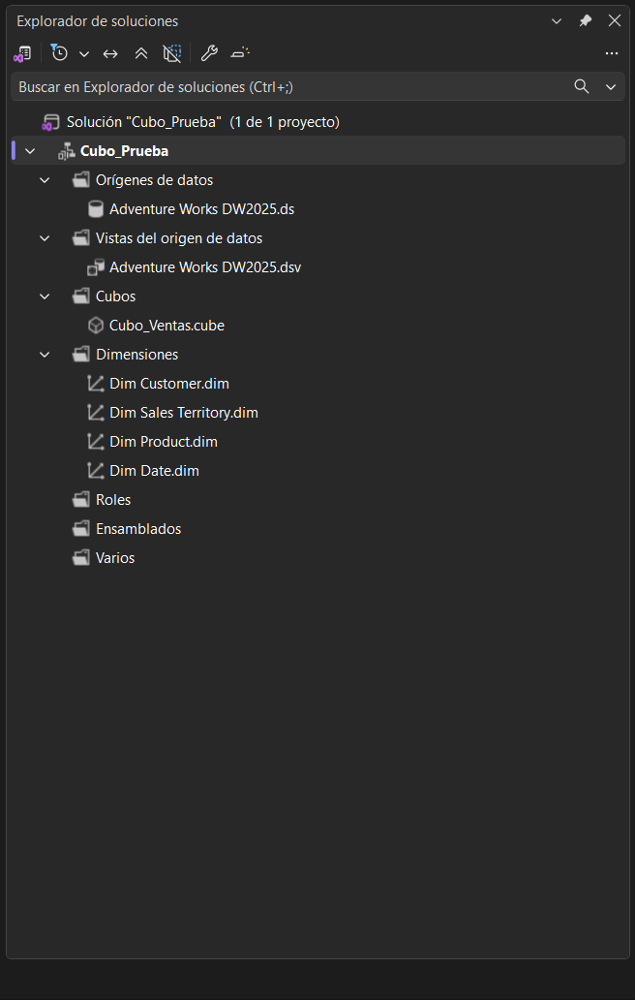
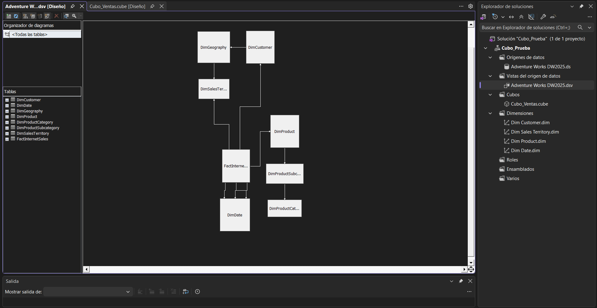
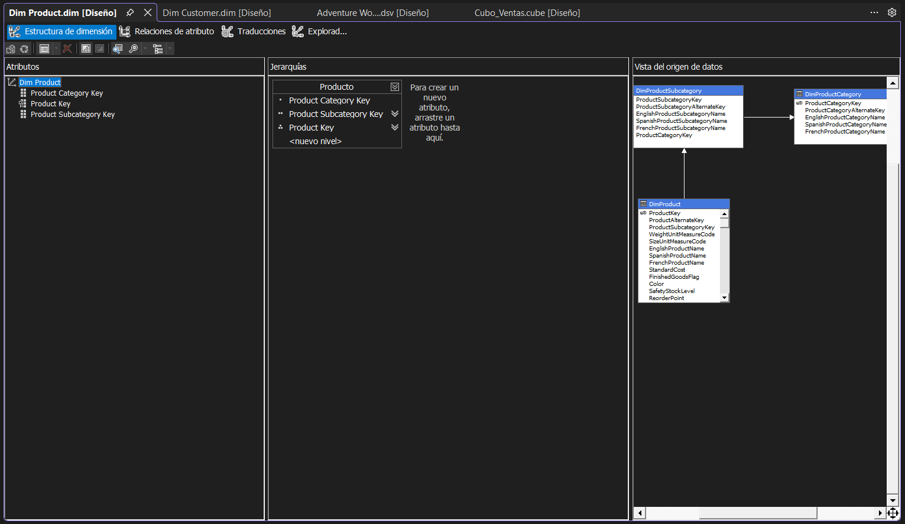
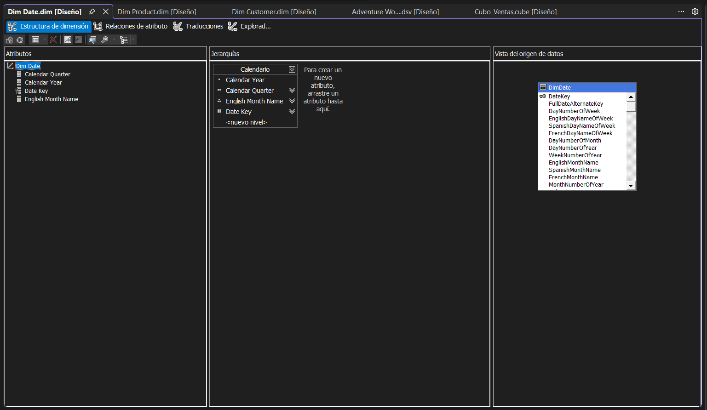
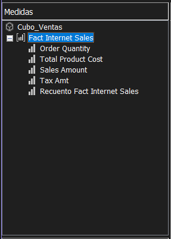
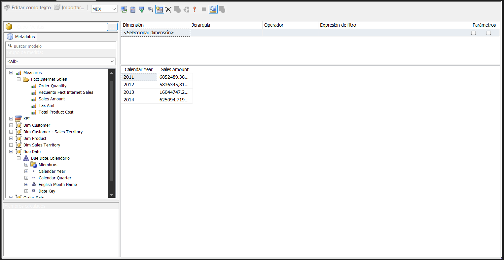
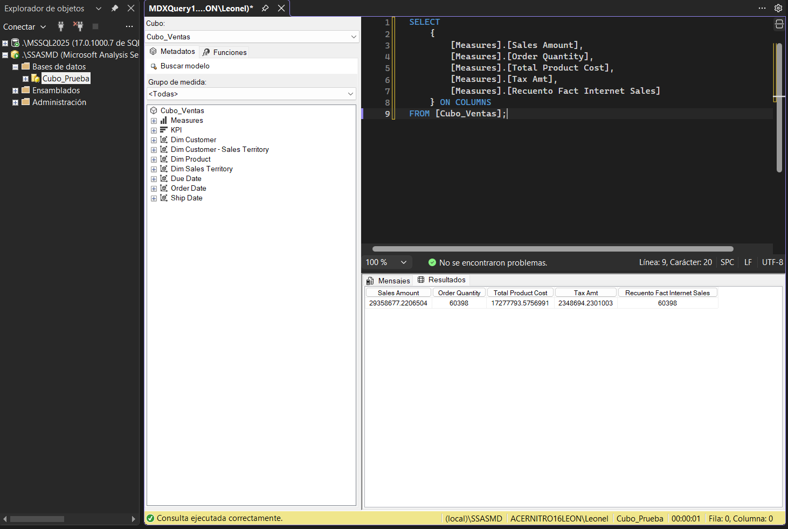

# Cubo multidimensional con SSAS

Cubo multidimensional de ventas creado con **SQL Server Analysis Services** y la
base de datos **AdventureWorksDW2025**.

## Contenido

- **Origen de datos** y vista del origen.
- **Dimensiones** de clientes, productos, territorios y fechas.
- **Jerarquías** de calendario y productos.
- **Medidas** de ventas, costos, impuestos y cantidades.
- Cubo **`Cubo_Ventas`** desplegado y procesado en SSAS.

## Requisitos previos

Para ejecutar el proyecto se necesita:

- **SQL Server 2025** con la base `AdventureWorksDW2025`.
- **SQL Server Analysis Services** en modo multidimensional.
- **Visual Studio** con la extensión **Analysis Services Projects**.

La base de datos de ejemplo está incluida en el archivo
**`AdventureWorksDW2025.bak`**.

## Configuración local

- Motor relacional: **`localhost\MSSQL2025`**
- Analysis Services: **`localhost\SSASMD`**
- Base de datos SSAS: **`Cubo_Prueba`**

Para abrir el proyecto, cargar **`Cubo_Prueba.slnx`**, compilar y desplegar.
Luego se puede consultar el cubo **`Cubo_Ventas`** desde el explorador de
Visual Studio, SSMS o cualquier herramienta compatible con MDX.

## Capturas

**Explorador de soluciones**

**Origen de datos**

**Dimensiones del cubo**

**Medidas del cubo**

**Explorador del cubo con datos**

**Consulta MDX con resultados**

## Autor

**Leonel Maximiliano Blumberg**
